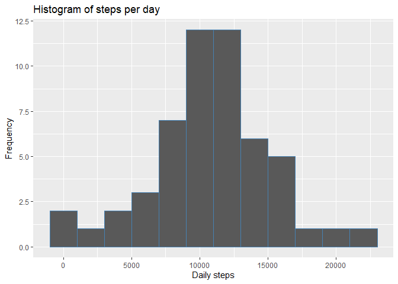
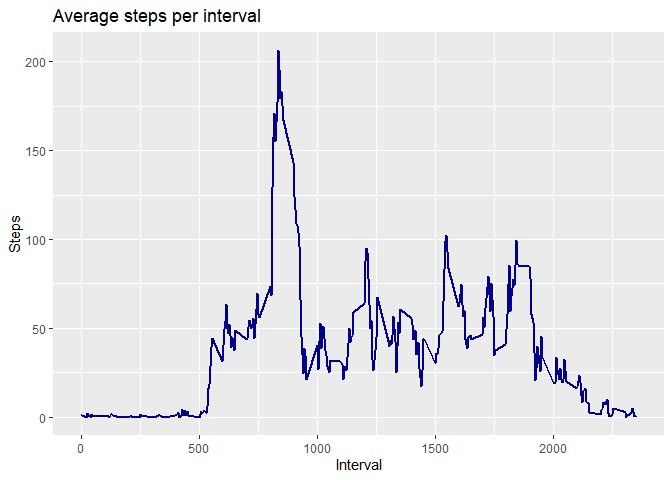
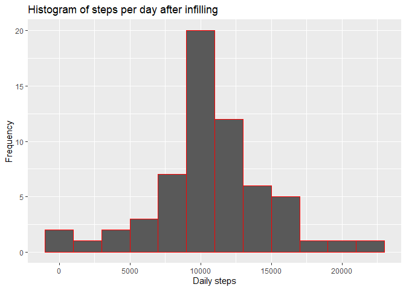
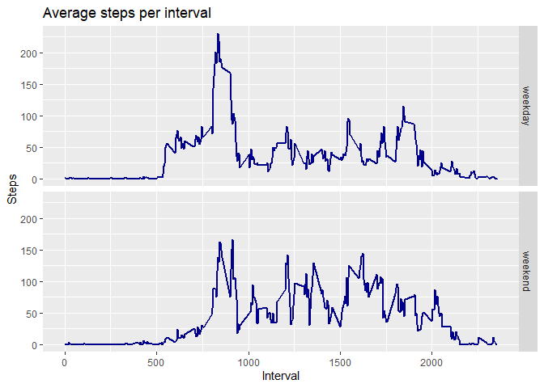

This assignment makes use of data from a personal activity monitoring device. This device collects data at 5 minute intervals through out the day. The data consists of two months of data from an anonymous individual collected during the months of October and November, 2012 and include the number of steps
taken in 5 minute intervals each day.

## Loading and preprocessing the data

Reading the csv file and aggregating the number of steps taken each day

```r
activity <- read.csv("activity.csv")
steps_daily <- aggregate(steps~date, activity, sum)
```

## Plotting a histogram of the total number of steps taken each day

ggplot2 system is used for plotting. 

```r
library(ggplot2)
g <- ggplot(steps_daily, aes(steps))
g <- g + geom_histogram(binwidth=2000, col="steelblue") + ggtitle("Histogram of steps per day")
g <- g + xlab("Daily steps") + ylab("Frequency")
print(g)
```

<!-- -->

## What is mean total number of steps taken per day?

Following two commands compute the mean and median of daily steps, respectively.

```r
mean(steps_daily$steps, na.rm=TRUE)
```

```
## [1] 10766.19
```

```r
median(steps_daily$steps, na.rm=TRUE)
```

```
## [1] 10765
```

## What is the average daily activity pattern?

Plotting the time series  of the average number of steps taken across all days for each 5-minute interval 

```r
steps_diurnal <- aggregate(steps~interval, activity, mean)
g <- ggplot(steps_diurnal, aes(interval, steps))
g <- g + geom_line(col="darkblue",size=1) + ggtitle("Average steps per interval")
g <- g + xlab("Interval") + ylab("Steps")
print(g)
```

<!-- -->

# Which 5-minute interval, on average across all the days in the dataset, contains the maximum number of steps?


```r
ind <- which.max(steps_diurnal$steps)
steps_diurnal$interval[ind]
```

```
## [1] 835
```

## Imputing missing values

Calculating the total number of missing values in the dataset and filling them with mean for that 5-minute interval. A new dataset activity_infill is created with all the missing values filled in. 

```r
sum(is.na(activity$steps))
```

```
## [1] 2304
```

```r
activity_infill <- activity
ind <- is.na(activity$steps)
activity_infill[ind,1] <- steps_diurnal$steps[match(activity$interval[ind],activity$interval)]
```

# Aggregating the new dataset according to each date.

```r
steps_daily_infill <- aggregate(steps~date, activity_infill, sum)
```

# Plotting a histogram of the total number of steps taken each day from the filled dataset 

```r
g <- ggplot(steps_daily_infill, aes(steps))
g <- g + geom_histogram(binwidth=2000, col="red") + ggtitle("Histogram of steps per day after infilling")
g <- g + xlab("Daily steps") + ylab("Frequency")
print(g)
```

<!-- -->

# Calculate the mean and median total number of steps taken per day.

```r
mean(steps_daily_infill$steps)
```

```
## [1] 10766.19
```

```r
median(steps_daily_infill$steps)
```

```
## [1] 10766.19
```

# What is the impact of imputing missing data on the estimates of the total daily number of steps?

```r
mean(steps_daily_infill$steps) - mean(steps_daily$steps)
```

```
## [1] 0
```

```r
median(steps_daily_infill$steps) - median(steps_daily$steps)
```

```
## [1] 1.188679
```
The difference due to imputing is zero for mean and very small for median.

## Are there differences in activity patterns between weekdays and weekends?

Creating a new factor variable in the filled dataset with two levels – “weekday” and “weekend” indicating whether a given date is a weekday or weekend.

```r
activity_infill$day <- weekdays(as.Date(activity_infill$date, format="%Y-%m-%d"))
activity_infill$day <- ifelse(activity_infill$day=='Saturday' | activity_infill$day=='Sunday', 'weekend','weekday')
```

Making a panel plot containing the time series plot of the average number of steps taken across all weekday and weekend days.

```r
steps_diurnal_day <- aggregate(steps~interval+day, activity_infill, mean)
g <- ggplot(steps_diurnal_day, aes(interval, steps))
g <- g + geom_line(col="darkblue",size=1) + ggtitle("Average steps per interval")
g <- g + xlab("Interval") + ylab("Steps")
g <- g + facet_grid(day ~ .)
print(g)
```

<!-- -->
